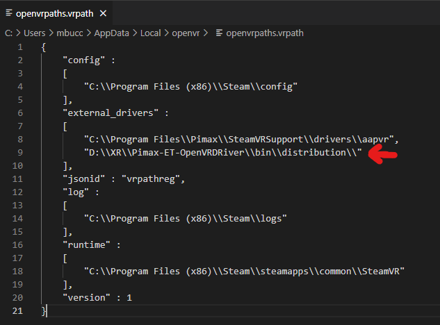
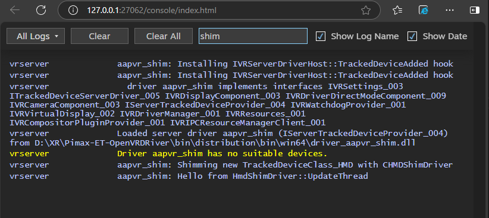

# A demo of Eye Tracking Driver and Driver Shimming with SteamVR.

This program shows how to shim (extend) and existing, pre-compiled, SteamVR driver in order to add support for Eye Tracking.

DISCLAIMER: This software is distributed as-is, without any warranties or conditions of any kind. Use at your own risks.

# If you are here only to get eye tracking on your Pimax Crystal / Pimax Crystal Super, go to the [Releases page](https://github.com/mbucchia/Pimax-EyeTracker-SteamVR/releases)

# Developer Walkthrough

## SteamVR API for Eye Tracking

Starting with SteamVR 2.8.3, the [`XR_EXT_eye_gaze_interaction`](https://registry.khronos.org/OpenXR/specs/1.0/man/html/XR_EXT_eye_gaze_interaction.html) OpenXR extension is advertised by the SteamVR OpenXR runtime. However, Valve yet has to publish an updated [OpenVR Driver SDK](https://github.com/ValveSoftware/openvr/tree/master/headers) with the necessary API for any 3rd party driver to send eye trackinh data to the extension.

In this project, we show how to use the undocumented API.

First, the driver must set property 6009 to indicate that it will send eye tracking data.

```cpp
    vr::VRProperties()->SetBoolProperty(container, (vr::ETrackedDeviceProperty)6009, true);
```

This effectively sets the value for the `XrSystemEyeGazeInteractionPropertiesEXT.supportsEyeGazeInteraction` property that applications can query:


Next, an HMD class driver must create a special component using the undocumented method of `IVRDriverInput`:

```cpp
    typedef vr::EVRInputError (*pfnCreateEyeTrackingComponent)(vr::IVRDriverInput* driverInput,
                                                                vr::PropertyContainerHandle_t ulContainer,
                                                                const char* pchName,
                                                                vr::VRInputComponentHandle_t* pHandle);
```

We retrieve a pointer to this method as follows:

```cpp
    const void** vtable = *((const void***)vr::VRDriverInput());
    IVRDriverInput_CreateEyeTrackingComponent = (pfnCreateEyeTrackingComponent)vtable[0x48 / 8];
```

And we invoke the method and store the resulting handle:

```cpp
    IVRDriverInput_CreateEyeTrackingComponent(vr::VRDriverInput(), container, "/eyetracking", &m_eyeTrackingComponent);
```

Finally, we can push eye tracking data to SteamVR when appropriate. We use a second undocumented method of `IVRDriverInput`:

```cpp
    struct VREyeTrackingData_t {
        uint16_t flag1;
        uint8_t flag2;
        DirectX::XMVECTOR vector;
    };
    typedef vr::EVRInputError (*pfnUpdateEyeTrackingComponent)(vr::IVRDriverInput* driverInput,
                                                               vr::VRInputComponentHandle_t ulComponent,
                                                               VREyeTrackingData_t* data);
```

We retrieve a pointer to this method as follows:

```cpp
    const void** vtable = *((const void***)vr::VRDriverInput());
    IVRDriverInput_UpdateEyeTrackingComponent = (pfnUpdateEyeTrackingComponent)vtable[0x50 / 8];
```

And we can invoke it and pass our eye gaze vector:

```
    VREyeTrackingData_t data{};
    if (isEyeTrackingDataAvailable) {
        // Not entirely sure what each bit means, but overall this means there is data to pass.
        data.flag1 = 0x101;
        data.flag2 = 0x1;
        data.vector = DirectX::XMVector3Normalize(DirectX::XMVectorSet(x, y, z, 1));
    } else {
        data.flag1 = 0;
        data.flag2 = 0;
        data.vector = DirectX::XMVectorSet(0, 0, -1, 1);
    }
    IVRDriverInput_UpdateEyeTrackingComponent(vr::VRDriverInput(), m_eyeTrackingComponent, &data);
```

The gaze vector is a unit vector that originates from the center of the head and points forward (z=-1).

## Driver Shimming with SteamVR

The driver shimming technique allows you to extend or modify the behavior or a driver without recompiling or altering the driver. If you are a driver developer and develop you own driver, you do not need this. This technique is helpful for driver "modders". This technique has been demonstrated in complex drivers, such as the [Virtual Desktop](https://www.vrdesktop.net/) driver for hand and full body tracking.

In order to shim an existing driver, we create our own driver, with its own `HmdDriverFactory()` entry point returning an `IServerTrackedDeviceProvider` class instance. This driver will register a hook that intercepts creation of the driver we are shimming.

Our shim driver must be loaded early, which can be accomplished by providing a `defaults.vrsettings` file that sets the loading priority to a high value:

```json
{
  "driver_battleaxevr_shim": {
    "loadPriority": 1000
  }
}
```

Next, in our driver's activation function, `IServerTrackedDeviceProvider::Init()`, we can optionally determine whether we should attempt shimming (for example, we can detect whether the devices we care about are connected). This step ensures that we don't unnecessarily load our driver:

```cpp
    vr::EVRInitError Init(vr::IVRDriverContext* pDriverContext) override {
        VR_INIT_SERVER_DRIVER_CONTEXT(pDriverContext);

        // Detect whether we should attempt to shim the target driver.
        if (!m_isLoaded) {
            bool loadDriver = false;
            try {
                // FIXME: Do our checks here.
                loadDriver = true;
            } catch (...) {
            }

            if (loadDriver) {
                DriverLog("Installing IVRServerDriverHost::TrackedDeviceAdded hook");
                InstallShimDriverHook(/* Pass useful parameters here */);
                m_isLoaded = true;
            }
        }

        return m_isLoaded ? vr::VRInitError_None : vr::VRInitError_Init_HmdNotFound;
    }
```

The `InstallShimDriverHook()` implementation shows how to install a hook for the `IVRServerDriverHost::TrackedDeviceAdded()` method. This method is the entry point for drivers to register an HMD, controller or tracker device. This is where we will inject ourselves. The current implementation hooks the `IVRServerDriverHost_006` flavor of the interface, which may need to be changed depending on the flavor that the shimmed driver uses.

When our shimmed driver registers an HMD for example, our hook will be invoked, and we can wrap the `ITrackedDeviceServerDriver` class instance from the shimmed driver with the implementaion of our shim driver:

```cpp
    DEFINE_DETOUR_FUNCTION(bool,
                           IVRServerDriverHost_TrackedDeviceAdded,
                           vr::IVRServerDriverHost* driverHost,
                           const char* pchDeviceSerialNumber,
                           vr::ETrackedDeviceClass eDeviceClass,
                           vr::ITrackedDeviceServerDriver* pDriver) {
        vr::ITrackedDeviceServerDriver* shimmedDriver = pDriver;

        // Only shim the desired device class and if they are registered by the target driver.
        if (IsTargetDriver(_ReturnAddress())) {
            TraceLoggingWriteTagged(local, "IVRServerDriverHost_TrackedDeviceAdded", TLArg(true, "IsTargetDriver"));
            if (eDeviceClass == vr::TrackedDeviceClass_HMD) {
                DriverLog("Shimming new TrackedDeviceClass_HMD with HmdShimDriver");
                shimmedDriver = CreateHmdShimDriver(pDriver /* Forward other useful parameters here */);
            }
        }

        const auto status = original_IVRServerDriverHost_TrackedDeviceAdded(
            driverHost, pchDeviceSerialNumber, eDeviceClass, shimmedDriver);

        return status;
    }
```

In order to only shim the devices from the desired driver, we perform a check `IsTargetDriver()` that attempts to identify the calling driver. In our case here, we only shim HMD classes registered by the `driver_aapvr.dll` driver (Pimax).

And this is it! You can now implement your own `ITrackedDeviceServerDriver` class that wraps any other driver, and insert pre-invocation and/or post-invocation code for any method.

### Useful tips for troubleshooting

Your shim driver should be registered via `vrpathreg.exe adddriver` like any other SteamVR driver. This effectively updates `%LocalAppData%\openvr\openvrpaths.vrpaths` with the path to your shim driver:



This will make your shim driver show up in the _Settings -> Startup/Shutdown -> Manage Add-ons_ menu:


Logs can be viewed by opening the SteamVR Developer Console:



Finally, one of the most effective method for debugging is to use Visual Studio (or your favorite tool) and run `vrserver.exe --keepalive`, then start SteamVR normally. This will let you step through the shim driver initialization, and break upon errors.
